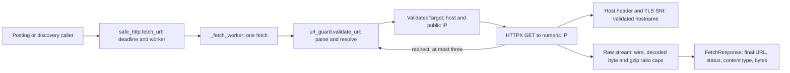

# Ingestion network architecture

Untrusted posting and discovery URLs enter `ingest.safe_http.fetch_url`. This library returns bounded response bytes and metadata. It does not extract HTML or PDF text, store a posting, call a model, or apply to a job. Those steps belong to separate components.

The worker calls the F1a guard at the first URL and at every redirect. The guard validates all DNS answers and returns the chosen IP. HTTPX connects to a numeric-IP URL, with the validated hostname in `Host` and its documented `sni_hostname` extension for certificate verification. Each hop uses a fresh client with redirects disabled and `trust_env=False`, so environment proxies and credentials cannot change where it connects. No cookies are replayed. The fragment is omitted from the request, while encoded path and query bytes are preserved. Redirect `Location` text is checked for literal controls, whitespace and backslashes before joining and validation.

Every request, including redirects, sends `User-Agent: cypress-creek/<installed version> (personal job search tool; +https://github.com/jpalicke/cypress-creek-job-board)` and `Accept-Encoding: gzip`. The version comes from package metadata. This identifies the tool honestly at the network boundary; it does not add browser execution, authentication or a user-facing posting workflow.

Only HTTP and HTTPS on ports 80 and 443 can pass the production URL guard. The independent provider adapter talks to its operator-configured model API, normally loopback, under the provider configuration rule. Its `httpx` use is explicitly allowed by the HTTP-import audit; it does not accept posting or discovery URLs. A provider's `allow_remote` setting cannot change the posting URL policy. Future posting and discovery fetchers must call `fetch_url`, never an HTTP client directly.

The public call starts a disposable Python child and grants one deadline for worker startup, operating-system DNS, all redirects, headers and body reading. A missed deadline kills and reaps the child, including a blocked resolver. The operating system can delay process creation and cleanup, so the configured timeout bounds worker activity rather than promising an exact return time. HTTPX also applies a connect timeout. Errors crossing the worker boundary are typed reason codes with generic messages, never a response body, URL, credential or socket error.

The final response body is read from raw network chunks. The defaults allow at most 10 MiB of wire data and 10 MiB of decoded data, with a 100:1 decoded-to-wire ratio. Only identity or one complete gzip stream is accepted; malformed, truncated and concatenated gzip streams fail. These byte caps govern the final body; redirect bodies are not read. The default content types are HTML, XHTML, plain text and PDF. A missing or different type fails. Callers may narrow the limits and type set, but cannot enable private URLs through any production argument, config field or environment variable.

The small loopback test entry lives only in `tests/http_support.py`. It substitutes a resolver for a named fixture inside the private transport function and worker; production `fetch_url` always invokes the worker with `validate_url`. Real local HTTP servers test redirects, limits, timeouts and cookie isolation. A real UDP DNS responder changes its answer between queries to test that the transport connects to the first validated IP. That rebinding test is compositional: the F1a public-address policy has independent tests, and the local fixture alone does not claim a production OS-DNS end-to-end rebinding proof.

See [the threat model](threat-model.md) for rules, error reasons and executable test commands, and [ADR 0013](adr/0013-pinned-http-transport.md) for the HTTP client and deadline choices.
