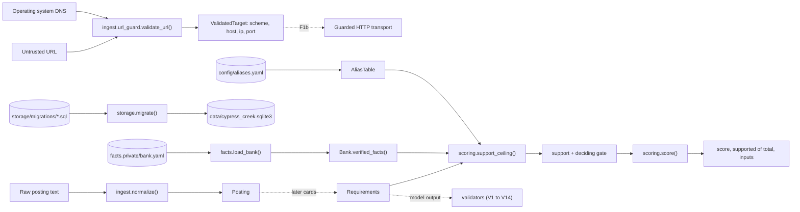

# Codebase guide

For a developer new to the project. Read the [README](../README.md) first, then this page, then pick up a card from the issue board.

## What the project does, in one paragraph
You give it a job posting. It pulls out the requirements, looks each one up in your personal fact bank (a YAML file of verified claims about your own work), reports honestly where you have no support, and only then helps draft an application. Every claim in the output must cite a verified fact. That is enforced by deterministic code (validators), never by prompting a model to behave. A human reviews every draft and nothing is ever sent automatically.

## The rule that shapes every decision
Nothing the tool outputs may assert a claim that is not backed by a verified fact ID in the fact bank. When you are unsure whether a change is allowed, ask whether it could let an unverified claim through. If so, it is not allowed. Model output is untrusted data until a validator passes it. All external input (postings, PDFs, feeds, model output) is hostile.

## Layout
```
config/                  Data that behaves like code but is edited by hand
  aliases.yaml           Tag alias table (requirement term to canonical tag)
  weights.yaml           Score weights and support values
  confusables.txt        Unicode confusables data (UTS #39), unmodified, used by company_key
docs/                    Documentation, indexed in docs/README.md
  adr/                   Decision records, one per design decision
scripts/                 Repo tooling run by hooks and CI (ABOUTME check, license check)
src/cypress_creek/       The library
  terms.py               normalize_term: the one term normalizer
  facts/                 The fact bank
    models.py            Fact, Tag, Evidence, Bank and their enums
    loader.py            Safe YAML loading, parse_bank, load_bank
    dates.py             Date sanity rules
    errors.py            BankLoadError, FactValidationError
  ingest/                Untrusted posting text in, clean models out
    models.py            Posting, Requirement, typed warnings
    normalize.py         normalize(), text_hash()
    hashing.py           The one definition of the text hash
    errors.py            PostingTooLong, EmptyPosting
    url_guard.py         validate_url, immutable ValidatedTarget, UrlGuardError with reason codes
  validators/            Grounding validators V1 to V14, pure functions returning Verdicts
    verdict.py           Verdict, ok(), fail()
    cues.py              The one list of importance cue words, sentence splitting
    extraction.py        V1 schema, V2 verbatim span, V3 importance cues
    citations.py         V4 fact exists, V5 fact verified, V6 fact shareable
    consistency.py       V7 entity consistency, V8 numeric consistency
    claims.py            V9 citation required, V10 novel term flag
    requirements.py      V11 cap and dedupe, V13 cue sentence coverage
    fact_dates.py        V12 date sanity (wraps facts/dates.py)
    names.py             V14 company name shape
    registry.py          REGISTRY: id, name, rule and function for each validator
  providers/             The model backend interface, typed errors and retry policy
    base.py              Provider protocol, Capabilities, CostPerMtok, Usage, StructuredResult
    errors.py            ContextTruncated, SchemaViolation, ProviderUnavailable, RateLimited, BudgetExceeded, Refusal
    retry.py             call_with_retry, RetryPolicy
    factory.py           get_provider, ProviderRegistry, UnknownProvider
    ollama.py            OllamaProvider and its pre-flight and post-flight truncation checks
  config/                Backend settings (not the repo level config/ data folder)
    settings.py          ProviderSettings, load_settings, resolve_api_key, ConfigError
  storage/               Mutable state: the company name key and the SQLite database
    company_key.py       company_key, load_confusables: the one company name normalizer
    db.py                data_dir, connect, migrate, schema_version, MigrationError
    migrations/          Numbered .sql files, one per schema change (0001_schema_version.sql)
  scoring/               Deterministic scoring, no model calls
    aliases.py           AliasTable, load_aliases
    support.py           candidate_facts, merged_years, support_ceiling
    score.py             Weights, load_weights, Match, downgrade, score, ScoreResult
tests/
  unit/                  Pure functions and models, no I/O beyond tmp files
  component/             Real files and real environment, several modules together
  integration/           Real public DNS (needs_network) and real Ollama requests (live)
  e2e/                   URL guard consumed from a separate Python process
  fixtures/              Recorded or hand written inputs
    hostile_outputs/     One bad model output per validator, plus a small bank (see validators.md)
  conftest.py            Fails the run if any test is skipped
```
`facts.private/` is where your own bank lives. It is gitignored and never committed.

## How the pieces fit today

Dotted means not built yet. Extraction, model verdicts, real provider adapters, validators, gap reports and drafting arrive in later cards (see the issue board and the spec). The pieces that exist are libraries with no app around them yet.

URL validation is a separate library entry point. It rejects unsafe syntax, resolves a hostname once, checks every address, and returns connection coordinates without fetching anything. The future transport must connect to the returned IP while using the hostname for Host and TLS verification; validation alone does not enforce this. See [the SSRF rules and limits](threat-model.md) and [ADR 0009](adr/0009-url-target-validation.md). The transport architecture and its import restriction are part of F1b.

## Ideas to know
- **One source of truth.** The bank file is the only record of facts. Verification is derived from `verified_on` and is never stored as a separate flag. The pipeline only ever sees `Bank.verified_facts()`.
- **Pure and deterministic.** Scoring functions take everything as arguments, including `today`. Nothing reads the clock or the network.
- **Data, not code.** Things a person should tune (the alias table, the score weights) or bundled third party data (the Unicode confusables) are YAML in `config/`, loaded and validated, never hard coded.
- **Typed errors.** Failures are specific exception classes (`PostingTooLong`, `FactValidationError`), so callers and tests can tell them apart. Text is rejected, never silently cut or repaired.
- **Public URL targets.** `validate_url` raises `UrlGuardError` with a stable `reason_code` and a generic message. It never echoes the URL or resolver error. Every DNS answer must pass the address checks before any one is selected; one private answer rejects the entire result.
- **Safe by default config.** Backends default to loopback only, going remote needs `allow_remote`, and keys come from the environment alone. Config errors never echo a submitted value.
- **Truncation is refused, not tolerated.** The Ollama adapter estimates before the call and checks the reported count after it, so a prompt the server would silently cut never produces an answer.
- **One retry place.** Providers raise typed errors and `providers.call_with_retry` is the only code that retries them. Adapters never loop on their own.
- **Frozen models.** Pydantic models are frozen and reject unknown fields, so a typo or smuggled field is an error.
- **Two stores, on purpose.** The fact bank and config are hand edited YAML (reviewable, diffable, versioned). Mutable app state, which later cards add (postings, drafts, watchlists), is SQLite behind numbered migrations.
- **Shared normalization.** `terms.normalize_term` is used for bank tags, requirement terms and the alias table, so they always compare under the same rules. Company names have their own single normalizer, `company_key`, which every blacklist, denied list and watchlist comparison must use.

## Working in the repo
Setup and the quality gates are in [contributing.md](contributing.md). In short:

```bash
uv sync
uv run pre-commit install
uv run pytest                      # all tests
uv run pre-commit run --all-files  # lint, format, strict types, tests with the 80% coverage gate
```

How a card goes:
1. Branch from main, one branch per card. No worktrees.
2. Write a failing test first and watch it fail. Then write the minimum code to pass, then refactor.
3. Keep each phase to at most five files and each PR to about 10 (hard cap 20), run the gates, then continue.
4. Update docs in the same PR (see the checklist in contributing.md).
5. Open a PR, get CI green, merge only after review.

Conventions you will trip over if you do not know them:
- Every code file starts with two comment lines beginning `ABOUTME: `. A hook checks it.
- No mocks, fake providers or stubbed HTTP. Use real files and real services, or recorded real outputs as inputs. An unreachable service fails the test, it never skips.
- Test output must be clean. Warnings are errors, and a skipped test fails the run.
- Names are evergreen: never "new", "improved" or "enhanced".
- No em dashes anywhere, including comments and commit messages.
- Do not mention any employer or industry in the repo.
- Never bypass hooks with `--no-verify`.
- Ports: API 5309, Vite dev server 5150. Infrastructure keeps its defaults.

## Adding a new thing, by example
- **Different score weights:** edit `config/weights.yaml`. `tests/component/test_weights_loader.py` shows the rules, and `docs/pipeline.md#score` must match if you change the defaults.
- **A new legal suffix for company names:** add it to `LEGAL_SUFFIXES` in `storage/company_key.py`, with a row in `tests/unit/test_company_key.py` first. **Newer Unicode confusables:** see the update steps in `docs/data-model.md`.
- **A new table or column:** add the next numbered file to `src/cypress_creek/storage/migrations/` (for example `0002_postings.sql`, with `-- ABOUTME: ` header lines), never edit an applied one, and add a test in `tests/component/test_migrations.py` or beside the new code. See `docs/data-model.md#storage-sqlite-and-migrations`.
- **A new tag alias:** add it to `config/aliases.yaml`. The tests in `tests/unit/test_aliases.py` show the rules (an alias belongs to one canonical tag).
- **A new fact field:** change `facts/models.py`, add a failing test in `tests/unit/test_fact_models.py` first, write an ADR if it is a design decision, and update `docs/data-model.md`.
- **A new pipeline stage:** a new module under the right package, typed errors beside it, tests in all relevant tiers, and a section in `docs/pipeline.md`.
- **A change to URL policy:** start with a hostile or accepted input in `tests/unit/test_url_guard.py`, then change `ingest/url_guard.py`. Keep the real-resolver, public-DNS and process tests passing and update [threat-model.md](threat-model.md). Never add an environment or config switch that permits private URLs.

## Where to look when something is unclear
Picking up a card from the board? [handoff.md](handoff.md) is the step by step routine.

The spec (linked from the issue board) is the design. The card's issue is the task. `CLAUDE.md` is the binding rules. `gotchas.md` is the list of past mistakes turned into rules. `docs/adr/` explains why things are the way they are.
