# Codebase guide

For a developer new to the project. Read the [README](../README.md) first, then this page, then pick up a card from the issue board.

## What the project does, in one paragraph
You give it a job posting. It pulls out the requirements, looks each one up in your personal fact bank (a YAML file of verified claims about your own work), reports honestly where you have no support, and only then helps draft an application. Every claim in the output must cite a verified fact. That is enforced by deterministic code (validators), never by prompting a model to behave. A human reviews every draft and nothing is ever sent automatically.

## The rule that shapes every decision
Nothing the tool outputs may assert a claim that is not backed by a verified fact ID in the fact bank. When you are unsure whether a change is allowed, ask whether it could let an unverified claim through. If so, it is not allowed. Model output is untrusted data until a validator passes it. All external input (postings, PDFs, feeds, model output) is hostile.

## Layout
```
config/                  Data that behaves like code but is edited by hand
  aliases.yaml           Tag alias table (requirement term to canonical tag)
  weights.yaml           Score weights and support values
  confusables.txt        Unicode confusables data (UTS #39), unmodified, used by company_key
docs/                    Documentation, indexed in docs/README.md
  adr/                   Decision records, one per design decision
scripts/                 Repo tooling run by hooks and CI (ABOUTME check, license check)
src/cypress_creek/       The library
  terms.py               normalize_term: the one term normalizer
  facts/                 The fact bank
    models.py            Fact, Tag, Evidence, Bank and their enums
    loader.py            Safe YAML loading, parse_bank, load_bank
    dates.py             Date sanity rules
    hashing.py           bank_hash: the one definition of the fact bank hash
    errors.py            BankLoadError, FactValidationError
  pipeline/              Stages that build model prompts (extraction wording lives in prompts/)
    prompt.py            Stage, Prompt (with user_message), build_prompt, prompt_facts, PromptError
    retrieve.py          retrieve, RequirementCandidates, MAX_CANDIDATES: tag and alias retrieval, no model
    schemas.py           ExtractionOutput, ProposedRequirement, EntailmentOutput, EntailmentVerdict: the shapes the models answer in
    extract.py           extract_requirements, ExtractionResult, accept_proposals, Acceptance, Dropped, DropReason
    entail.py            entail, judge, EntailedMatch, Entailment: stage 3, the verdict only lowers support
    report.py            GapReport, build_report, verify_report, ReportRefused: stage 4, the report as data
    render.py            render_text: stage 5, the plain text view of a report
    run.py               analyze, assess, run_id: the whole run, with provenance and a run id derived from its inputs
    prompts/             Versioned system texts, one file per stage and version (extract_v2.txt, entail_v1.txt)
  ingest/                Untrusted posting text in, clean models out
    models.py            Posting, Requirement, typed warnings
    normalize.py         normalize(), text_hash()
    hashing.py           The one definition of the text hash
    errors.py            PostingTooLong, EmptyPosting
    url_guard.py         validate_url, immutable ValidatedTarget, UrlGuardError with reason codes
    safe_http.py         fetch_url, FetchLimits, FetchResponse, SafeHttpError; pinned, bounded HTTP
    fetch.py             fetch_posting, FetchResult, provenance and typed posting fetch errors
    html_text.py         html_to_text, ExtractedText, hidden warnings and typed size/depth errors
    _fetch_worker.py     Disposable fetch process that bounds blocking DNS by a whole-fetch deadline
  validators/            Grounding validators V1 to V14, pure functions returning Verdicts
    verdict.py           Verdict, ok(), fail()
    cues.py              The one list of importance cue words, sentence splitting
    extraction.py        V1 schema, V2 verbatim span, V3 importance cues
    citations.py         V4 fact exists, V5 fact verified, V6 fact shareable
    consistency.py       V7 entity consistency, V8 numeric consistency
    claims.py            V9 citation required, V10 novel term flag
    requirements.py      V11 cap and dedupe, V13 cue sentence coverage
    fact_dates.py        V12 date sanity (wraps facts/dates.py)
    names.py             V14 company name shape
    registry.py          REGISTRY: id, name, rule and function for each validator
  providers/             The model backend interface, typed errors and retry policy
    base.py              Provider protocol, Capabilities, CostPerMtok, Usage, StructuredResult, estimate_input_tokens
    errors.py            ContextTruncated, SchemaViolation, ProviderUnavailable, RateLimited, BudgetExceeded, Refusal
    retry.py             call_with_retry, RetryPolicy
    factory.py           get_provider, ProviderRegistry, UnknownProvider
    ollama.py            OllamaProvider and its pre-flight and post-flight truncation checks
    budget.py            Budget, BudgetTracker, BudgetedProvider, dry_run_estimate, budget_from_settings
  config/                Backend settings (not the repo level config/ data folder)
    settings.py          ProviderSettings, load_settings, resolve_api_key, ConfigError
  storage/               Mutable state: the company name key and the SQLite database
    company_key.py       company_key, load_confusables: the one company name normalizer
    db.py                data_dir, connect, migrate, schema_version, MigrationError
    migrations/          Numbered .sql files, one per schema change (0001_schema_version.sql, 0002_discovery.sql, 0003_blacklist.sql)
  discovery/             Discovery state in SQLite, no network
    watchlist.py         WatchlistEntry, Watchlist, Tombstoned, AlreadyWatched, IdentityEvidence
    tombstones.py        Tombstones, Denial, DenialReason, normalize_board: denied companies kept as denied suggestion rows
    blacklist.py         The pure filter: is_blacklisted, Candidate, BlacklistEntry, BlockReason, normalize_slug, normalize_domain, InvalidBlacklistValue
    blacklist_repository.py  Blacklist (add, remove, rows, entries) and AlreadyBlacklisted: stores and loads entries, no matching
  scoring/               Deterministic scoring, no model calls
    aliases.py           AliasTable, load_aliases
    support.py           candidate_facts, merged_years, support_ceiling
    score.py             Weights, load_weights, Match, downgrade, score, ScoreResult
evals/
  bank/                  The fictional sample fact bank, its unverified lure file and PLANTED_GAPS.md (see evals.md)
tests/
  unit/                  Pure functions and models, no I/O beyond tmp files
  component/             Real files and real environment, several modules together
  integration/           Real public DNS (needs_network) and real Ollama requests (live)
  e2e/                   URL guard, posting fetch and HTML text extraction from separate processes
  http_support.py        Test-only real HTTP and UDP DNS servers, with a loopback resolver
  fixtures/              Recorded or hand written inputs
    extraction/          A posting and a recorded real model output for the accept step
    html/postings.json   Anonymized excerpts of three public ATS posting layouts
    hostile_outputs/     One bad model output per validator, plus a small bank (see validators.md)
  conftest.py            Fails the run if any test is skipped
```
`facts.private/` is where your own bank lives. It is gitignored and never committed.

## How the pieces fit today

```mermaid
flowchart LR
    url[Untrusted URL] --> fetcher["ingest.fetch.fetch_posting(): raw bytes + provenance"]
    fetcher --> transport["ingest.safe_http.fetch_url(): pinned HTTP transport"]
    transport --> guard["ingest.url_guard.validate_url()"]
    resolver[Operating system DNS] --> guard
    guard --> target["ValidatedTarget: scheme, host, ip, port"]
    target --> request["numeric-IP HTTP GET"]
    request --> response["bounded response bytes"]
    response --> fetched["FetchResult"]
    fetched -->|HTML bytes| html["ingest.html_text.html_to_text()"]
    html --> norm
    raw[Raw posting text] --> norm["ingest.normalize()"]
    norm --> posting[Posting]
    posting --> extract["pipeline.extract_requirements()"]
    extract --> reqs[Requirements]
    migs[(storage/migrations/*.sql)] --> migrate["storage.migrate()"]
    migrate --> db[(data/cypress_creek.sqlite3)]
    bank[(facts.private/bank.yaml)] --> load["facts.load_bank()"]
    load --> verified["Bank.verified_facts()"]
    aliases[(config/aliases.yaml)] --> table[AliasTable]
    reqs --> gate["scoring.support_ceiling()"]
    verified --> gate
    table --> gate
    gate --> ceiling["support + deciding gate"]
    ceiling --> score["scoring.score()"]
    score --> result["score, supported of total, inputs"]
    reqs -. model output .-> val["validators (V1 to V14)"]
```

The diagram shows library components, not a running app workflow. The link fetcher returns raw bytes, and a caller can pass HTML bytes separately to the HTML text extractor before normalization. PDF text extraction, a user-facing app workflow and drafting remain later cards (see the issue board and the spec).

URL validation is a separate library entry point. It rejects unsafe syntax, resolves a hostname once, checks every address, and returns connection coordinates without fetching anything. `fetch_url` uses that selected IP for the connection while retaining the hostname for Host and TLS verification. It revalidates every redirect, bounds the final response and gives DNS resolution a whole-fetch deadline in a child process. The test audit restricts HTTP client imports to this transport and the separate Ollama provider adapter. See [the fetching architecture](architecture.md), [the SSRF rules and limits](threat-model.md), [ADR 0009](adr/0009-url-target-validation.md) and [ADR 0013](adr/0013-pinned-http-transport.md).

`fetch_posting(url)` is the one-off, user-initiated library caller. It applies the fixed transport policy and returns HTML, plain text or PDF bytes with requested and final URL provenance. Typed failures distinguish blocked targets, disallowed content, size limits, authentication and empty responses. HTML callers can then use `html_to_text` as a separate step. See [the setup guide](setup.md), [HTML extraction](pipeline.md#html-posting-text) and [ADR 0015](adr/0015-link-fetch-browser-signals.md).

## Ideas to know
- **One source of truth.** The bank file is the only record of facts. Verification is derived from `verified_on` and is never stored as a separate flag. The pipeline only ever sees `Bank.verified_facts()`.
- **Pure and deterministic.** Scoring functions take everything as arguments, including `today`. Nothing reads the clock or the network.
- **Data, not code.** Things a person should tune (the alias table, the score weights) or bundled third party data (the Unicode confusables) are YAML in `config/`, loaded and validated, never hard coded.
- **Typed errors.** Failures are specific exception classes (`PostingTooLong`, `FactValidationError`), so callers and tests can tell them apart. Text is rejected, never silently cut or repaired.
- **Public URL targets.** `validate_url` raises `UrlGuardError` with a stable `reason_code` and a generic message. It never echoes the URL or resolver error. Every DNS answer must pass the address checks before any one is selected; one private answer rejects the entire result.
- **Pinned HTTP connections.** `fetch_url` connects only to the validated numeric IP, disables environment proxies and redirects, then handles redirects itself. Every hop sends a versioned, honest User-Agent. It returns bytes only after content-type and size checks. `SafeHttpError` has stable reason codes and generic messages.
- **Posting fetch boundary.** `fetch_posting` is the public one-off entry for posting links. It returns raw bytes and provenance, not normalized text. HTTP 401 yields `NeedsBrowser` with manual-paste guidance; ambiguous HTML stays bytes for the separate parser. Errors do not expose hostile response text.
- **HTML content boundary.** `html_to_text` drops non-content tags, supported hidden styles and attributes, plus conservative nav, footer and cookie boilerplate. It retains headings and list items as lines, reports hidden elements, and rejects input above 10 MiB or nesting above 128 elements. It does not run JavaScript or fetch resources; external CSS visibility is unknown. See [the pipeline guide](pipeline.md#html-posting-text).
- **Safe by default config.** Backends default to loopback only, going remote needs `allow_remote`, and keys come from the environment alone. Config errors never echo a submitted value.
- **Measured truncation signatures are refused.** The Ollama adapter estimates before the call and checks the reported count after it. It raises `ContextTruncated` when the estimate exceeds the configured context or the count matches a measured truncation signature. Other server behavior may need additional detection.
- **Spend is capped before it happens.** `BudgetedProvider` checks the worst case (estimate plus output cap) against the run limits before a call and records the server's real usage after it. Real usage above an estimate blocks the next call, so the guard fails closed.
- **Posting text never leaves its block.** `build_prompt` puts the posting between boundary lines carrying a random 128 bit token, keeps it out of the system message and shows extraction no facts. It is the first layer only, the validators are the control.
- **The model proposes, code decides.** The extraction model gives text, kind and term. Spans, ids and importance are set by code, and text that is not in the posting is dropped with a reason. See `pipeline.md`.
- **Entailment can only lower support.** The model's verdict is clamped to the rule ceiling by code, and `Match` refuses support above its ceiling. A drop of any size is allowed. See [ADR 0011](adr/0011-entailment-can-only-lower-support.md).
- **A positive verdict must cite.** `judge` counts a `supports` or `partial` verdict with no valid citation (candidate, verified, shareable) as `does_not_support`, and withholds any rationale that fails V7 to V10. See `pipeline.md`.
- **A run id is derived, not random.** `run_id` hashes the posting, the fact bank, the backend and the model, so the same inputs give the same id and a changed input gives a new one. See `pipeline.md`.
- **A report cites or is refused.** `build_report` ends with `verify_report` (V4, V5, V9), so a fabricated or unverified fact id never reaches a report. Failed stages make the report incomplete rather than quietly partial. See `pipeline.md`.
- **Retrieval is not a model.** `retrieve` matches tags and aliases, ranks and caps the candidates, and sets the support ceiling. A requirement with no candidate is a gap and costs no model call. See `pipeline.md`.
- **The sample bank and its gap table cannot drift.** `PLANTED_GAPS.md` is parsed by a test that runs each row through `retrieve`, so a bank edit that changes a gap fails the build. See `evals.md`.
- **A denial is permanent until a human removes it.** A denied company is a tombstone matched by `company_key` and by normalized board, and `Watchlist.add` refuses it. Only `Tombstones.remove` lifts one. See [ADR 0017](adr/0017-tombstones-are-removed-only-by-a-human-call.md).
- **The blacklist filter is pure and runs first.** `is_blacklisted(candidate, entries)` takes everything as arguments, touches no database and no network, and returns the `BlockReason` (company key, slug or domain) or `None`. It is meant to run on a discovered company before any fetch. Entries are normalized when created, and `Blacklist` only stores them. See [data-model.md](data-model.md#discovery-the-blacklist).
- **One retry place.** Providers raise typed errors and `providers.call_with_retry` is the only code that retries them. Adapters never loop on their own.
- **Frozen models.** Pydantic models are frozen and reject unknown fields, so a typo or smuggled field is an error.
- **Two stores, on purpose.** The fact bank and config are hand edited YAML (reviewable, diffable, versioned). Mutable app state, which later cards add (postings, drafts, watchlists), is SQLite behind numbered migrations.
- **Shared normalization.** `terms.normalize_term` is used for bank tags, requirement terms and the alias table, so they always compare under the same rules. Company names have their own single normalizer, `company_key`, which every blacklist, denied list and watchlist comparison must use. Blacklist slugs and domains likewise have one normalizer each, `normalize_slug` and `normalize_domain` in `discovery/blacklist.py`.

## Working in the repo
Setup and the quality gates are in [contributing.md](contributing.md). In short:

```bash
uv sync
uv run pre-commit install
uv run pytest                      # all tests
uv run pre-commit run --all-files  # lint, format, strict types, tests with the 80% coverage gate
```

How a card goes:
1. Branch from main, one branch per card. No worktrees.
2. Write a failing test first and watch it fail. Then write the minimum code to pass, then refactor.
3. Keep each phase to at most five files and each PR to about 10 (hard cap 20), run the gates, then continue.
4. Update docs in the same PR (see the checklist in contributing.md).
5. Open a PR, get CI green, merge only after review.

Conventions you will trip over if you do not know them:
- Every code file starts with two comment lines beginning `ABOUTME: `. A hook checks it.
- No mocks, fake providers or stubbed HTTP. Use real files and real services, or recorded real outputs as inputs. An unreachable service fails the test, it never skips.
- Test output must be clean. Warnings are errors, and a skipped test fails the run.
- Names are evergreen: never "new", "improved" or "enhanced".
- No em dashes anywhere, including comments and commit messages.
- Do not mention any employer or industry in the repo.
- Never bypass hooks with `--no-verify`.
- Ports: API 5309, Vite dev server 5150. Infrastructure keeps its defaults.

## Adding a new thing, by example
- **Different score weights:** edit `config/weights.yaml`. `tests/component/test_weights_loader.py` shows the rules, and `docs/pipeline.md#score` must match if you change the defaults.
- **A new legal suffix for company names:** add it to `LEGAL_SUFFIXES` in `storage/company_key.py`, with a row in `tests/unit/test_company_key.py` first. **Newer Unicode confusables:** see the update steps in `docs/data-model.md`.
- **A new table or column:** add the next numbered file to `src/cypress_creek/storage/migrations/` (for example `0003_postings.sql`, with `-- ABOUTME: ` header lines), never edit an applied one, and add a test in `tests/component/test_migrations.py` or beside the new code. See `docs/data-model.md#storage-sqlite-and-migrations`.
- **A new blacklist match kind:** add a `BlockReason` member and its normalizer in `discovery/blacklist.py`, write the failing unit rows in `tests/unit/test_blacklist_filter.py` first, then add the kind to the `CHECK` list with the next numbered migration (never edit `0003_blacklist.sql`) and update [data-model.md](data-model.md#discovery-the-blacklist).
- **A new tag alias:** add it to `config/aliases.yaml`. The tests in `tests/unit/test_aliases.py` show the rules (an alias belongs to one canonical tag).
- **A new fact field:** change `facts/models.py`, add a failing test in `tests/unit/test_fact_models.py` first, write an ADR if it is a design decision, and update `docs/data-model.md`.
- **A new pipeline stage:** a new module under the right package, typed errors beside it, tests in all relevant tiers, and a section in `docs/pipeline.md`.
- **A change to URL policy:** start with a hostile or accepted input in `tests/unit/test_url_guard.py`, then change `ingest/url_guard.py`. Keep the real-resolver, public-DNS and process tests passing and update [threat-model.md](threat-model.md). Never add an environment or config switch that permits private URLs.
- **A new posting fetch caller:** use `ingest.fetch.fetch_posting` and handle its typed `FetchError` subclasses. Discovery transport work may call `ingest.safe_http.fetch_url` directly. Do not import an HTTP client in another module. Keep the transport's unit, component, public-network and process tests passing, and update [architecture.md](architecture.md) if the boundary changes.
- **A change to HTML extraction:** start with hostile markup in `tests/unit/test_html_text.py`, then update `ingest/html_text.py`. Keep the ATS layout component cases in `tests/component/test_html_fixtures.py` and the public-network and process tests passing. Update [pipeline.md](pipeline.md#html-posting-text) and [threat-model.md](threat-model.md#html-content-boundary) when visibility or limits change.

## Where to look when something is unclear
Picking up a card from the board? [handoff.md](handoff.md) is the step by step routine.

The spec (linked from the issue board) is the design. The card's issue is the task. `CLAUDE.md` is the binding rules. `gotchas.md` is the list of past mistakes turned into rules. `docs/adr/` explains why things are the way they are.
