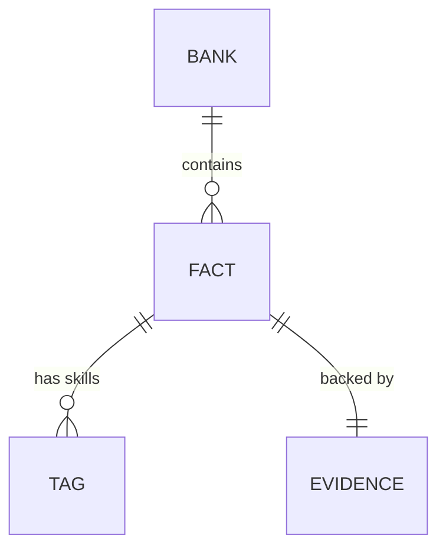

# Data model

## Fact bank
The bank is a hand edited YAML file validated on load (pydantic v2, safe YAML). It is the single source of truth for what the tool may claim.

```yaml
facts:
  - id: F-0001                  # unique, pattern F-0000, never reused
    claim: Built a nightly report generator for a fictional logistics team.   # one sentence, 1 to 300 chars
    kind: project               # employment | project | education | certification | achievement
    employer: Example Freight Co
    role: Engineer
    start: 2022-01-01
    end: 2023-01-01             # start may not be after end
    tags:
      - {name: python, level: expert}   # level: familiar | working | expert
    verified_on: 2024-05-01     # the ONLY source of verification state
    evidence: {type: repo, pointer: "https://example.invalid/repo"}
    share: shareable            # shareable | local_only (default local_only)
```

Evidence types: `employer_doc`, `repo`, `certificate`, `public_url`, `self_attested`.



## Rules
- Unknown fields, bad ids, duplicate ids, claims over 300 characters, unknown enum values and malformed dates are rejected with a `FactValidationError` naming the fact id and the field.
- Dates may not be in the future and `start` may not be after `end` (`cypress_creek.facts.dates.date_problems`, the one implementation, also used later by validator V12).
- Verification is derived: a fact with `verified_on` is verified. There is no boolean.
  - Normal mode: a fact without `verified_on` loads as unverified and is listed by `Bank.unverified_ids()`.
  - Strict mode (used by the eval harness): a fact without `verified_on` is rejected.
  - A malformed `verified_on` is rejected in both modes.
- The pipeline only ever receives `Bank.verified_facts()`.
- YAML anchors and aliases, python object tags and files over 1 MB are refused (`BankLoadError`).

See [ADR 0001](adr/0001-fact-bank-enums-and-defaults.md) for the enum and default decisions.

## Where the bank lives
Your personal bank goes in `facts.private/bank.yaml` (gitignored). Set `CYPRESS_CREEK_BANK` to use another path. A fictional sample bank ships later (card E1).

## Try it locally
```bash
mkdir facts.private
# save a bank like the example above as facts.private/bank.yaml, then:
uv run python -c "from cypress_creek.facts import load_bank; b = load_bank(); print(len(b.facts), 'facts,', len(b.verified_facts()), 'verified; unverified:', b.unverified_ids())"
```
Add `strict=True` to `load_bank` to see the strict mode behavior.

## Posting and Requirement
Both live in `src/cypress_creek/ingest/models.py` and are frozen, extra-forbid pydantic models.

**Posting**: `id`, `source` (paste, link, pdf, feed), `text` (already normalized), `text_hash` (sha256 of the text, checked against it on construction), `origin_url`, `extractor` (name and version), `warnings[]`, `created_at` (passed in, never read from a clock).

**Requirement**: `id` (`R-n`), `text` (verbatim span), `span` (start, end offsets into the posting text), `kind` (skill, years, education, certification, responsibility, soft), `term` (normalized with the same function as bank tags), `years` (optional positive int), `importance` (required, preferred, unspecified).

The models only describe shape. Checking that `text` really is the posting's text at `span`, and that `importance` fits the cue words, is the job of validators V2 and V3 (card B4). A `Requirement` can be passed straight to the support gate.

**Warnings** are typed (`PostingWarning`: kind and count). The only kind so far is `control_chars_stripped`.

## Tag alias table
Requirement terms rarely match a bank tag word for word ("postgres" versus "postgresql"). The alias table in `config/aliases.yaml` maps each canonical tag name to the other terms that mean the same thing. It is data, not code, so you can extend it without touching Python.

```yaml
aliases:
  postgresql: [postgres, psql, pg]
  kubernetes: [k8s]
```

Rules:
- Every term, alias and fact tag name goes through the same normalization (`cypress_creek.terms.normalize_term`: NFKC, casefold, whitespace collapsed, edge punctuation trimmed). `c++`, `c#` and `.net` survive intact.
- An alias may appear under only one canonical tag, and may not equal another canonical tag. Either is a load error.
- A term the table does not know stands for itself, so a tag still matches a requirement that uses the identical word.

## Try the alias table
```bash
uv run python -c "from cypress_creek.scoring.aliases import load_aliases; print(load_aliases().resolve('Postgres'))"
```
