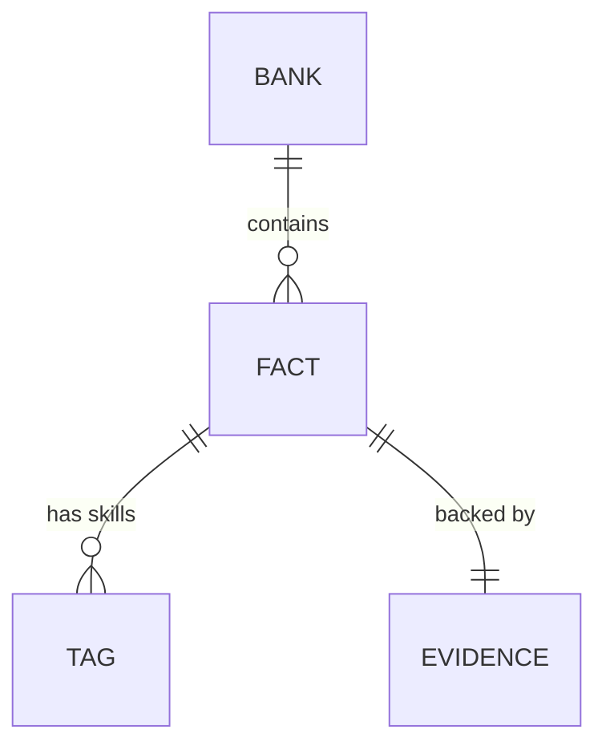

# Data model

## Fact bank
The bank is a hand edited YAML file validated on load (pydantic v2, safe YAML). It is the single source of truth for what the tool may claim.

```yaml
facts:
  - id: F-0001                  # unique, pattern F-0000, never reused
    claim: Built a nightly report generator for a fictional logistics team.   # one sentence, 1 to 300 chars
    kind: project               # employment | project | education | certification | achievement
    employer: Example Freight Co  # for employment and projects
    issuer: null                  # for education and certification: the school or certifying body
    role: Engineer
    start: 2022-01-01
    end: 2023-01-01             # start may not be after end
    tags:
      - {name: python, level: expert}   # level: familiar | working | expert
    verified_on: 2024-05-01     # the ONLY source of verification state
    evidence: {type: repo, pointer: "https://example.invalid/repo"}
    share: shareable            # shareable | local_only (default local_only)
```

Evidence types: `employer_doc`, `repo`, `certificate`, `public_url`, `self_attested`.



## Rules
- Unknown fields, bad ids, duplicate ids, claims over 300 characters, unknown enum values and malformed dates are rejected with a `FactValidationError` naming the fact id and the field.
- Dates may not be in the future and `start` may not be after `end` (`cypress_creek.facts.dates.date_problems`, the one implementation, also used later by validator V12).
- `issuer` is optional free text naming the school or certifying body of an education or certification fact. It is trimmed and must contain a letter or digit. Employment and project facts keep using `employer`. See [ADR 0006](adr/0006-issuer-field-and-issuer-matching.md).
- Verification is derived: a fact with `verified_on` is verified. There is no boolean.
  - Normal mode: a fact without `verified_on` loads as unverified and is listed by `Bank.unverified_ids()`.
  - Strict mode (used by the eval harness): a fact without `verified_on` is rejected.
  - A malformed `verified_on` is rejected in both modes.
- The pipeline only ever receives `Bank.verified_facts()`.
- YAML anchors and aliases, python object tags and files over 1 MB are refused (`BankLoadError`).

See [ADR 0001](adr/0001-fact-bank-enums-and-defaults.md) for the enum and default decisions.

## Where the bank lives
Your personal bank goes in `facts.private/bank.yaml` (gitignored). Set `CYPRESS_CREEK_BANK` to use another path. A fictional sample bank ships later (card E1).

## Try it locally
```bash
mkdir facts.private
# save a bank like the example above as facts.private/bank.yaml, then:
uv run python -c "from cypress_creek.facts import load_bank; b = load_bank(); print(len(b.facts), 'facts,', len(b.verified_facts()), 'verified; unverified:', b.unverified_ids())"
```
Add `strict=True` to `load_bank` to see the strict mode behavior.

## Posting and Requirement
Both live in `src/cypress_creek/ingest/models.py` and are frozen, extra-forbid pydantic models.

**Posting**: `id`, `source` (paste, link, pdf, feed), `text` (already normalized), `text_hash` (sha256 of the text, checked against it on construction), `origin_url`, `extractor` (name and version), `warnings[]`, `created_at` (passed in, never read from a clock).

**Requirement**: `id` (`R-n`), `text` (verbatim span), `span` (start, end offsets into the posting text), `kind` (skill, years, education, certification, responsibility, soft), `term` (normalized with the same function as bank tags), `years` (optional positive int), `issuer` (optional school or certifying body the posting names, same rules as the fact field), `importance` (required, preferred, unspecified).

The models only describe shape. Checking that `text` really is the posting's text at `span`, and that `importance` fits the cue words, is the job of validators V2 and V3 (card B4). A `Requirement` can be passed straight to the support gate.

**Warnings** are typed (`PostingWarning`: kind and count). The only kind so far is `control_chars_stripped`.

## Tag alias table
Requirement terms rarely match a bank tag word for word ("postgres" versus "postgresql"). The alias table in `config/aliases.yaml` maps each canonical tag name to the other terms that mean the same thing. It is data, not code, so you can extend it without touching Python.

```yaml
aliases:
  postgresql: [postgres, psql, pg]
  kubernetes: [k8s]
```

Rules:
- Every term, alias and fact tag name goes through the same normalization (`cypress_creek.terms.normalize_term`: NFKC, casefold, whitespace collapsed, edge punctuation trimmed). `c++`, `c#` and `.net` survive intact.
- An alias may appear under only one canonical tag, and may not equal another canonical tag. Either is a load error.
- A term the table does not know stands for itself, so a tag still matches a requirement that uses the identical word.

## Try the alias table
```bash
uv run python -c "from cypress_creek.scoring.aliases import load_aliases; print(load_aliases().resolve('Postgres'))"
```

## Company names: `company_key`
Blacklists, the denied list and the watchlist all compare companies on one key from `company_key(name)` in `src/cypress_creek/storage/company_key.py`. It is a security control (a blacklist bypass by case, spacing, homoglyphs or suffix games must not work), so there is exactly one function and nothing else normalizes a company name.

Steps, in order:
1. Reject names over 1,000 characters (`CompanyNameError`).
2. NFKD, which splits accents off and turns full-width and styled letters into plain ones, then casefold.
3. Fold confusables with the Unicode confusables data in `config/confusables.txt` (the UTS #39 skeleton table, about 6,700 entries). Examples: Cyrillic `а` becomes `a`, `0` becomes `o`, `1` becomes `l`, `m` becomes `rn`. The table is applied several times because a target can itself be confusable (`%` becomes `0`, which becomes `o`).
4. Accent marks and zero-width and other format characters are dropped. Periods and apostrophes are dropped without splitting a word (`L.L.C.` becomes `llc`, `O'Reilly` becomes `oreilly`). Any other non letter, non digit character separates words.
5. `i` becomes `l`. Casefolding turns a capital `I` into `i` before the table can map it to `l`, so without this `IBM` and `lBM` would differ.
6. Trailing legal suffixes are stripped repeatedly: `inc`, `incorporated`, `llc`, `llp`, `ltd`, `limited`, `corp`, `corporation`, `gmbh`, `plc` (compared in folded form). A suffix in the middle of a name stays, and a name that is only a suffix keeps it. Every addition to `LEGAL_SUFFIXES` needs a test row.
7. Words are joined with no spaces, so `Ac me` and `Acme` match. A name with no letters or digits raises `CompanyNameError`.

`Acme, Inc.`, `ACME Incorporated`, `Ac me`, `A.C.M.E.`, `Acrne`, a full-width spelling and a Cyrillic lookalike spelling all give the same key. `IBM`, `lBM` and `1BM` match, and so do `Oracle` and `0racle`. Keys are for comparison only and are not readable (`Acme` becomes `acrne`), so never show one to a person. The result is idempotent, which a Hypothesis test checks, and a component test checks every character in the shipped data.

Known limits: the table is the Unicode data, so a lookalike it does not list is not folded, and `w` versus `vv` is one such pair. Folding also applies inside genuinely non Latin names, which is fine because keys are only compared. Different companies that differ only by lookalike letters or spacing collide, which for a blacklist fails safe. Slug and domain matching is a later card (H1).

To update the data, download the latest `confusables.txt` from the URL in `NOTICE`, replace the file, update the version line in `NOTICE`, and run the tests. See [ADR 0004](adr/0004-company-key-rules.md).

## Try company_key
```bash
uv run python -c "from cypress_creek.storage.company_key import company_key; print(company_key('Аcme, L.L.C.'), company_key('ACME Incorporated'))"
```

## Storage: SQLite and migrations
Two stores, on purpose. The fact bank and config (`config/*.yaml`) are hand edited YAML: reviewable, diffable and the source of truth for what the tool may claim. Everything that changes while the app runs (postings, drafts, watchlists, later cards) is SQLite, one file, no server, in the standard library. See [ADR 0005](adr/0005-sqlite-and-migrations.md).

Code is `src/cypress_creek/storage/db.py`:
- `data_dir()` is `CYPRESS_CREEK_DATA_DIR` or `data/` (gitignored). `database_path()` is `<data dir>/cypress_creek.sqlite3`.
- `connect(path)` creates the file and its folders, turns foreign keys on and leaves transactions explicit.
- `migrate(conn)` applies the numbered files in `src/cypress_creek/storage/migrations/` that the database has not seen, in order, and returns the versions it applied. A second run applies nothing.
- `schema_version(conn)` is the highest applied version (0 for a new database).

Migration rules:
- Files are named `NNNN_short_name.sql` (four digits, lower case letters, digits and underscores). Numbers start at 1 and have no gaps or duplicates.
- Each file runs in one transaction together with its row in `schema_version`. If it fails, nothing from that file is kept and `MigrationError` names the file. Do not put `BEGIN` or `COMMIT` in a migration.
- A whole folder is checked before anything runs, so a bad name, a gap or a file that is not utf-8 changes nothing.
- A database newer than the code, or one whose applied name differs from the file of that number, is refused. Never edit or rename a migration that has been applied; add a new one.
- `0001_schema_version.sql` creates the version table and holds no domain data. Each card that needs tables adds its own file. `0002_discovery.sql` creates the discovery tables described below.

Known limits: there are no checksums, so an edited applied migration is not detected (only a renamed one is). There is no downgrade path. The database file is not encrypted.

## Discovery: watchlist and tombstones
Code is in `src/cypress_creek/discovery/`. Tables come from `0002_discovery.sql`:
- `listing`: a posting found on a company board. `id` is `ats:slug:job_id`, `state` is new, seen or closed. Nothing writes listings yet.
- `watchlist_entry`: an approved company. `company_key` is the key, derived from `display_name` by `company_key()` and never supplied. `(ats, slug)` is unique, stored trimmed and lower case, and neither part may be empty. `identity_evidence` is strong, weak or none. It is written only by a human approval, so `Watchlist.add` takes the approval time from the caller and never reads a clock.
- `suggestion`: a proposed company. `state` is pending, approved or denied. A denied row is the permanent tombstone, one per company and board. `ats` and `slug` are both set or both empty. Nothing writes pending or approved rows until the suggestion card.

Rules, in `watchlist.py` and `tombstones.py`:
- `Watchlist.add` refuses with `Tombstoned` when a denied row matches the company key or the board, and with `AlreadyWatched` when the company or the board is already listed. A refusal writes nothing. See [ADR 0017](adr/0017-tombstones-are-removed-only-by-a-human-call.md).
- A board is compared trimmed and lower case, through `normalize_board`, so `Greenhouse/Acme ` and `greenhouse/acme` are one board. An empty ATS or slug raises `InvalidBoard`.
- A tombstone is lifted only by `Tombstones.remove(name=...)`, which lifts every board of that company. Adding to the watchlist never lifts one. The `Tombstoned` message names the denied company to pass to `remove`.
- Names are stored and returned as plain text. A name with no letters or digits is refused with `CompanyNameError`.

Known limits: removing a tombstone keeps no history of the denial, and the blacklist table and routes come in later cards.

## Try the discovery tables
```bash
uv run python - <<'PY'
import tempfile
from datetime import UTC, datetime
from pathlib import Path

from cypress_creek.discovery.tombstones import Tombstones
from cypress_creek.discovery.watchlist import IdentityEvidence, Tombstoned, Watchlist, WatchlistEntry
from cypress_creek.storage.db import connect, migrate

conn = connect(Path(tempfile.mkdtemp()) / "try.sqlite3")
migrate(conn)
now = datetime.now(UTC)
Tombstones(conn).deny(name="Acme Corp", ats="greenhouse", slug="acme", proposed_by="me", decided_at=now)
try:
    Watchlist(conn).add(WatchlistEntry("ACME Corporation", "lever", "other", IdentityEvidence.WEAK, now))
except Tombstoned as error:
    print(error)
PY
```
It prints `ACME Corporation matches a denied company: Acme Corp`. The variant name is refused because it has the same company key as the denied one.

## Try the database
```bash
uv run python -c "from cypress_creek.storage.db import connect, database_path, migrate, schema_version; c = connect(database_path()); print('applied', migrate(c), 'now at version', schema_version(c)); print('again', migrate(c))"
```
The first run prints `applied [1, 2]` and creates `data/cypress_creek.sqlite3`. Running it again prints `applied []`. Delete the `data/` folder to start over.
